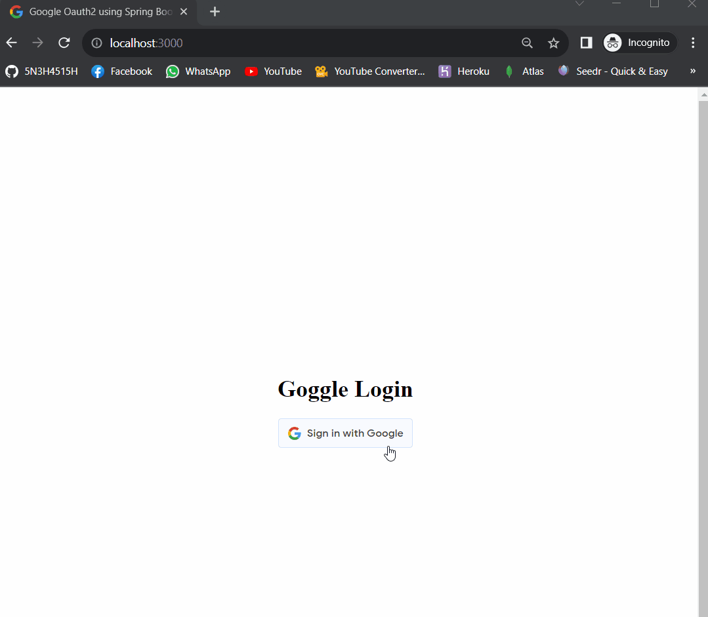
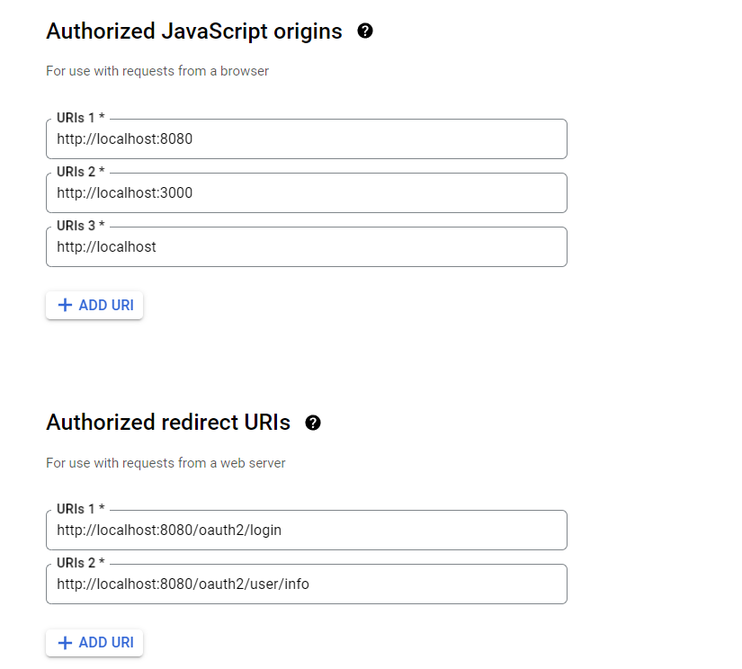

# Spring Boot React OAuth2 Login



This project demonstrates OAuth2 login functionality using Google authentication in a Spring Boot backend and React frontend. Users can log in via Google OAuth and access protected resources.

## Prerequisites

Before you begin, make sure to set up a Google OAuth credential by following these steps:

1. Go to the [Google API Console](https://console.developers.google.com/projectselector/apis/credentials?pli=1).
2. Add your **Authorized JavaScript Origins** and **Authorized Redirect URIs**. Ensure that `email` and `profile` scopes are added in your Google project's OAuth2 consent screen.



## Setting Up the Backend Server (server)

1. **Create MySQL Database:**

   ```sql
   mysql> create database spring_react_oauth
   ```

2. **Configure Database and OAuth2 Settings:**

   ```properties
   # server/src/main/resources/application.properties
   spring.datasource.url=jdbc:mysql://localhost:3306/spring_react_oauth?useSSL=false
   spring.datasource.username=<YOUR_DB_USERNAME>
   spring.datasource.password=<YOUR_DB_PASSWORD>

   # server/src/main/resources/application.yml
   app:
     # Signing key for HS512 algorithm
     # Generate keys at http://www.allkeysgenerator.com/
     jwtSecret: v9y$B&E)H@MbQeThWmZq4t7w!z%C*F-JaNdRfUjXn2r5u8x/A?D(G+KbPeShVkYp
     googleClientId: <GOOGLE_CLIENT_ID>
   ```

3. **Run the Backend Server:**

   ```bash
   mvn spring-boot:run
   ```

## Setting Up the Frontend Server (client)

1. Edit the value of `VITE_APP_GOOGLE_CLIENT_ID` in `react-oauth/.env` to your Google Client ID.

   ```js
   VITE_APP_API_URL="http://localhost:8080"
   VITE_APP_GOOGLE_CLIENT_ID=<GOOGLE_CLIENT_ID>
   ```

2. **Install Dependencies and Start Frontend:**

   ```bash
   cd client
   npm install && npm run dev
   ```

This project combines Spring Boot's robust backend with React's interactive frontend, allowing users to experience seamless OAuth2 login with Google. For detailed instructions and troubleshooting, refer to the respective documentation in the `server` and `client` directories.

Feel free to customize and extend this project based on your requirements! If you have any questions or need further assistance, please don't hesitate to ask.
